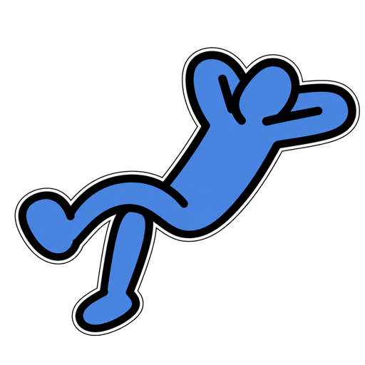

# SCENE Studio

**사진 한 장으로 만드는 나만의 포스터와 모션**

 

 

좋아하는 사진에 음악과 문구를 더하고, 움직임을 담아 보세요. 
별도의 설치나 회원가입 없이 웹페이지에서 바로 사용할 수 있습니다.

---

## ✨ 주요 기능

### 🎵 뮤직 포스터

좋아하는 사진과 곡 정보를 조합해 음악 플레이어 스타일의 포스터를 만듭니다.

- 곡명, 아티스트, 재생 시간 입력
- 사진에서 어울리는 색상 다섯 가지 자동 추출
- 스포이트로 원하는 부분의 색상 추출
- 배경색 변경 및 색상 팔레트 표시 설정
- 사진 확대와 위치 조정
- 원하는 해상도로 PNG 저장

### 📷 포커스 모션

사진에 초점이 맞춰지는 순간과 카메라 촬영 효과를 담아 움직이는 이미지로 만듭니다.

| 스타일 | 표현 |
| --- | --- |
| iPhone | iOS 클래식 카메라 스타일 |
| Galaxy | One UI 카메라 스타일 |
| 미러리스 | 라이브 뷰 촬영 화면 |
| 캠코더 | Handycam 스타일의 레트로 촬영 화면 |
| 패럴랙스 | 부드러운 줌과 배경 효과 |
| 라이트스틱 | 빛이 떠오르는 보케 효과 |

- 세로·가로 방향 선택
- 자막 입력, 색상 변경, 기울임 설정
- 저장 전 모션 미리보기
- 재생·일시정지, 다시 재생, 원하는 구간 탐색
- 반복 재생 설정
- PNG 또는 3.6초 GIF 저장

### 🎞️ 인생네컷

최대 네 장의 사진을 하나의 프레임에 담아 나만의 네 컷 사진을 만듭니다.

- 사진별 확대와 위치 조정
- 프레임 색상 변경
- 하단 문구 추가
- 오늘 날짜 표시 여부 선택
- 완성된 사진을 PNG로 저장

---

## 🚀 사용 방법

1. **SCENE Studio 페이지에 접속합니다.**
2. **뮤직 포스터 · 포커스 모션 · 인생네컷** 중 원하는 작업을 선택합니다.
3. 사진을 추가하고 색상, 문구, 사진 위치를 조정합니다.
4. 미리보기로 결과를 확인한 뒤 **PNG 저장** 또는 **GIF 저장**을 누릅니다.

사진은 버튼으로 선택하거나 화면에 끌어놓을 수 있으며, 복사한 이미지를 붙여넣는 것도 가능합니다.

---

## 💾 이미지 저장

| 기능 | 저장 형식 | 출력 크기 |
| --- | --- | --- |
| 뮤직 포스터 | PNG | 1080 × 1920 · 1320 × 2868 · 1080 × 2340 · 1440 × 3120 |
| 포커스 모션 | PNG | 세로 1080 × 1920 · 가로 1920 × 1080 |
| 포커스 모션 | GIF | 긴 변 360~1920 px 중 선택 |
| 인생네컷 | PNG | 1200 × 3600 |

GIF는 **3.6초 길이**로 만들어집니다. 크기를 높일수록 저장에 시간이 더 걸리고 파일 용량도 커질 수 있습니다.

---

## 🎨 화면과 테마

- PC와 모바일 화면에 맞춘 반응형 구성
- 기기의 테마 설정에 따라 적용되는 라이트·다크 모드
- 편집 내용을 바로 확인할 수 있는 미리보기

---

## 🔐 사진 처리

선택한 사진은 **사용 중인 기기의 브라우저 안에서 처리**됩니다.

- 사진을 별도 서버에 업로드하지 않습니다.
- 회원가입이나 로그인이 필요하지 않습니다.
- 편집한 결과물은 직접 파일로 저장할 수 있습니다.

페이지를 닫거나 새로고침하기 전에 필요한 결과물을 저장해 주세요.

---

## 💡 이용 안내

- 사진은 **파일당 최대 25 MB**까지 추가할 수 있습니다.
- JPG, PNG, WebP, AVIF, GIF 이미지를 선택할 수 있으며, 지원 여부는 브라우저에 따라 달라질 수 있습니다.
- GIF 사진을 추가하면 원본의 움직임 대신 정지 이미지로 사용됩니다.
- GIF 저장이 오래 걸리면 출력 크기를 낮춰 다시 시도해 주세요.
- 카메라 스타일은 사진에 적용하는 시각 효과이며, 실제 기기의 카메라를 제어하는 기능은 아닙니다.

---

**SCENE / MAKE IT YOURS**

